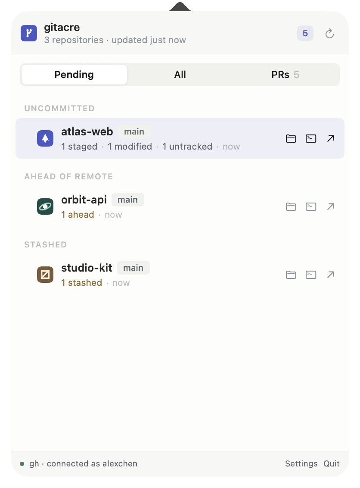

<p align="center">
  
</p>

<h1 align="center">gitacre</h1>

<p align="center">
  <strong>Your Git work, one glance away.</strong><br>
  A native macOS menu-bar app for local changes, linked worktrees, and pull requests.
</p>

<p align="center">
  <a href="https://github.com/shivamx96/gitacre/releases/download/v1.0.0-beta/gitacre-1.0.0-beta.dmg">Download 1.0.0-beta</a>
  ·
  <a href="release-notes/1.0.0-beta.md">Release notes</a>
</p>

<p align="center">
  
</p>

gitacre keeps the Git work that needs your attention close at hand—without making you open a terminal. Choose the folders where your repositories live and gitacre quietly monitors them from the menu bar.

## What it shows

- **Pending local work:** staged, modified, untracked, conflicted, ahead, behind, and stashed states in one compact list.
- **Linked worktrees:** every checkout stays grouped beneath its repository, with branch-level status and direct actions.
- **Pull requests:** review requests and PRs opened by you, using the GitHub CLI session already active on your Mac.
- **Quick actions:** reveal a checkout in Finder, open it in your preferred terminal, or visit its remote repository.
- **A native macOS experience:** keyboard navigation, automatic background refresh, launch at login, light and dark appearances, and a global Option-Command-G shortcut.

## Get started

1. [Download the latest beta](https://github.com/shivamx96/gitacre/releases/download/v1.0.0-beta/gitacre-1.0.0-beta.dmg).
2. Open the disk image and drag `gitacre` into Applications.
3. Launch gitacre, open Settings, and choose the folders that contain your repositories.
4. Look for the gitacre icon in the menu bar, or press Option-Command-G.

The Pull Requests view is optional. To use it, install the [GitHub CLI](https://cli.github.com/) and sign in with `gh auth login`. Local repository monitoring works without GitHub or network access.

## Requirements

- macOS 14 Sonoma or later
- Apple silicon or Intel Mac
- GitHub CLI only for the optional Pull Requests view

## Private by construction

Repository scanning happens locally. For pull requests, gitacre invokes the official GitHub CLI and reuses its active `github.com` session; it does not read or store your authentication token.

## Build from source

Building gitacre requires Xcode 16 or newer.

```sh
git clone https://github.com/shivamx96/gitacre.git
cd gitacre
scripts/build-app.sh
open build/gitacre.app
```

For a development run without creating an app bundle:

```sh
swift run Gitacre
```

Run the test suite with:

```sh
swift test
```

## Project resources

- The static product site and its screenshots live in [`website/`](website/).
- Maintainers can find signing, notarization, and packaging instructions in [`docs/RELEASING.md`](docs/RELEASING.md).
- Bugs and feature requests can be reported through [GitHub Issues](https://github.com/shivamx96/gitacre/issues).

gitacre is currently prerelease software.
